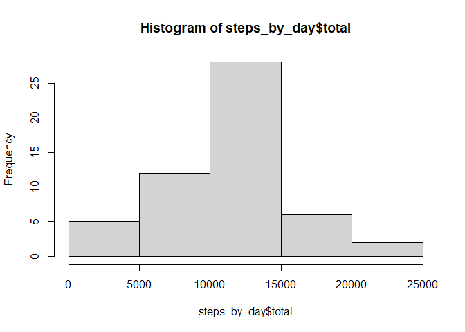
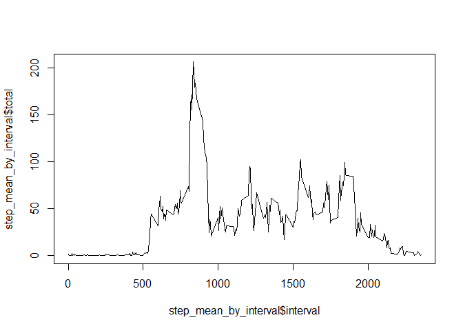
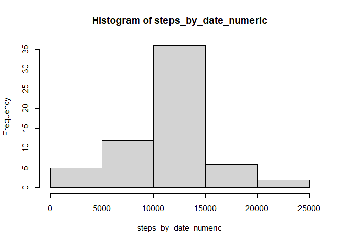
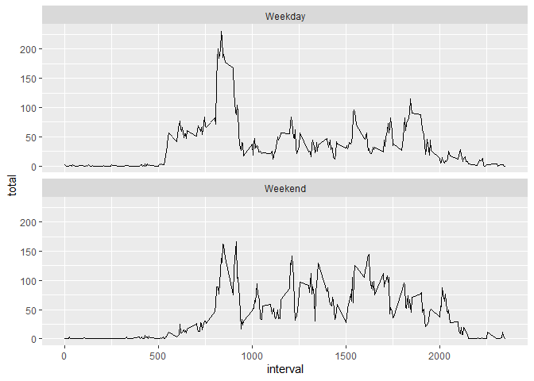

## Loading and pre-processing the data

``` r
library(dplyr)  
```

```
## 
## Attaching package: 'dplyr'
```

```
## The following objects are masked from 'package:stats':
## 
##     filter, lag
```

```
## The following objects are masked from 'package:base':
## 
##     intersect, setdiff, setequal, union
```

``` r
data = "activity.csv"  
raw_activity_data = read.csv(data)  
raw_activity_data$date<-as.Date(raw_activity_data$date)
```
Data loaded, date column coerced into date format

## What is mean total number of steps taken per day?
1.) Calculate the total number of steps taken per day

``` r
raw_activity_data %>%  
  group_by(date) %>%  
  summarise(total = sum(steps)) -> steps_by_day  
```
2.) Histogram of total steps each day

``` r
hist(steps_by_day$total)  
```

<!-- -->

``` r
steps_daily_numeric<-sapply(steps_by_day$total,as.numeric)  
mean_steps <- mean(steps_daily_numeric,na.rm = TRUE)  
median_steps <- median(steps_daily_numeric,na.rm = TRUE)
print(paste("3.) Mean Steps: ", mean_steps))
```

```
## [1] "3.) Mean Steps:  10766.1886792453"
```

``` r
print(paste("    Median Steps: ", median_steps))
```

```
## [1] "    Median Steps:  10765"
```


## What is the average daily activity pattern?

``` r
raw_activity_data %>%  
  group_by(interval) %>%  
  summarise(total = mean(steps,na.rm=TRUE)) -> step_mean_by_interval  
print("1.) 5 minute interval averages graph: ")  
```

```
## [1] "1.) 5 minute interval averages graph: "
```

``` r
plot(step_mean_by_interval$interval,step_mean_by_interval$total,type="l")  
```

<!-- -->

``` r
print(paste("2.) Interval with the most steps: ",which.max(step_mean_by_interval$total)))  
```

```
## [1] "2.) Interval with the most steps:  104"
```


## Imputing missing values

``` r
missing_row_count<-sum(is.na(raw_activity_data))  
print(paste("1.) Number of missing rows: ", missing_row_count))  
```

```
## [1] "1.) Number of missing rows:  2304"
```
2.) Devise a strategy for filling in missing values. I used the mean for 
  intervals and inserted it into the corresponding null values. I did this 
  over averaging per day as some days (10/1 for instance) has only null values")  

3.) Create a new dataset equal to the original but with missing values 
  filled in

``` r
filled_activity_data <- left_join(raw_activity_data, step_mean_by_interval, by = "interval")  
filled_activity_data <- mutate(filled_activity_data, steps = coalesce(steps,total))  

filled_activity_data %>%  
  group_by(date) %>%  
  summarise(total = sum(steps,na.rm=TRUE)) -> step_mean_by_date  

steps_by_date_numeric<-sapply(step_mean_by_date$total, as.numeric)  
```
4.) Make a histogram, print mean and median steps

``` r
mean_steps <- mean(steps_by_date_numeric,na.rm = TRUE)  
median_steps <- median(steps_by_date_numeric,na.rm = TRUE)
hist(steps_by_date_numeric)
```

<!-- -->

``` r
print(paste("Mean Steps: ", mean_steps))
```

```
## [1] "Mean Steps:  10766.1886792453"
```

``` r
print(paste("Median Steps: ", median_steps))
```

```
## [1] "Median Steps:  10766.1886792453"
```

## Are there differences in activity patterns between weekdays and weekends?
1.) Create a new factor variable for weekday, and plot weekdays and weekends to see if there's a difference

``` r
library(ggplot2)
filled_activity_data <- mutate(filled_activity_data, weekday = weekdays(date))  
filled_activity_data <- mutate(filled_activity_data, weekend = ifelse(filled_activity_data$weekday %in% c("Saturday","Sunday"),"Weekend","Weekday"))
filled_activity_data <- select(filled_activity_data,-total)
filled_activity_data %>%  
  group_by(interval,weekend) %>%  
  summarise(total = mean(steps)) -> step_mean_by_weekday_and_interval  
```

```
## `summarise()` has grouped output by 'interval'. You can override using the
## `.groups` argument.
```

``` r
ggplot(step_mean_by_weekday_and_interval, aes(x = interval, y = total)) +
  geom_line() +
  facet_wrap(~weekend, ncol = 1)
```

<!-- -->

